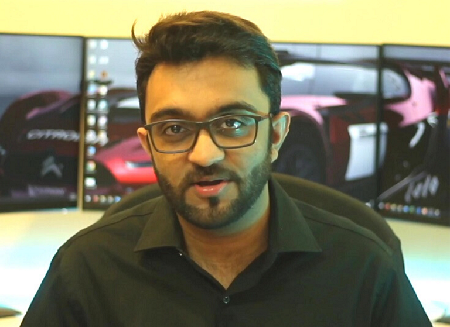

# Video Motion Analyzer

Интерактивное настольное приложение на Qt и OpenCV для анализа видео в реальном времени, визуализации FPS и мониторинга активности движения.

## О проекте

Приложение объединяет Qt Widgets, модуль Qt Charts и OpenCV 4, чтобы выводить поток с веб-камеры или из файла в двух окнах: оригинальное изображение и обработанный кадр с подсветкой движущихся объектов. Для каждой сессии ведётся график кадров в секунду и график уровня движения, что помогает быстро оценить стабильность потока и интенсивность активности в кадре.

Проект оформлен в стиле классического Qt-приложения: основная логика управления интерфейсом находится в `MainWindow`, обработка кадров вынесена в отдельный поток `VideoProcessor`, а источники данных абстрагированы через фабрику `FactoryUI`.

## Основные возможности

- Захват видео из веб-камеры или загрузка локальных файлов (`.mp4`, `.avi` и др.).
- Параллельная обработка кадров с помощью OpenCV BackgroundSubtractorKNN и подсветка областей движения.
- Два независимых графика на Qt Charts: актуальный FPS и уровень движения.
- Управление воспроизведением: старт, пауза, стоп, быстрое переключение источника.
- Переключатель отображения контуров движения без прерывания обработки.

## Интерфейс

- **Главные окна**: слева оригинальный поток, справа — обработанное изображение.
- **Переключатель источника**: `Камера` или `Из файла`, с контекстными панелями управления.
- **Панель действия**: кнопки запуска, паузы, остановки, выбора файла.
- **Дополнительные элементы**: чекбокс «Отображать движение» и кнопка «Сброс графика» — перезапускают сбор статистики.
- **Графики**: `FramePlotWidget` и `MotionPlotWidget` строят скользящие окна длиной ~10 секунд.



## Быстрый старт

### Требования

- Qt 5.15+ или Qt 6 с модулями Widgets, Concurrent, Charts.
- OpenCV 4 с поддержкой VideoIO.
- C++17 совместимый компилятор.

Для Ubuntu/Debian:

```bash
sudo apt update
sudo apt install qtbase5-dev qtcharts5-dev libopencv-dev build-essential
```

Для Qt 6 замените пакеты на `qt6-base-dev`, `qt6-charts-dev` и установите `qt6-base-dev-tools`.

### Сборка через Qt Creator

1. Откройте `videoEditor.pro` в Qt Creator.
2. Выберите подходящий комплект (Desktop Qt + нужная версия).
3. Нажмите **Configure Project**, затем **Build** и **Run**.

### Сборка из командной строки

```bash
cd /workspace
mkdir -p build && cd build
qmake ../videoEditor.pro    # или qt6 qmake, если используется Qt 6
make -j$(nproc)
./videoEditor
```

## Использование

1. Запустите приложение — по умолчанию откроется поток с камеры.
2. Переключитесь на режим «Из файла», чтобы выбрать локальное видео (`Resources/test_video.mp4` можно использовать для проверки).
3. Наблюдайте за прямой трансляцией и обработанным кадром с подсветкой контуров.
4. Следите за графиками FPS и уровня движения; используйте «Сброс графика» для очистки истории.
5. Отключайте отображение контуров, если требуется максимум FPS.

## Структура проекта

- `main.cpp` — точка входа и запуск GUI.
- `mainwindow.*` — базовая логика интерфейса, управление потоками и графиками.
- `videoprocessor.*` — обработка кадров в отдельном потоке, подсветка движений.
- `factoryui.*`, `fromcamui.*`, `fromfileui.*`, `abstractui.*` — абстракция источников видео.
- `frameplotwidget.*`, `motionplotwidget.*`, `fpscollector.*` — визуализация и сбор статистики.
- `Resources/` — изображения и тестовое видео.

## Полезные заметки

- Файл `res.qrc` добавляет тестовый ролик в ресурсы; при сборке на Qt он будет доступен по пути `:/video/Resources/test_video.mp4`.
- Алгоритм движения использует порог 0.01 и минимальную площадь 400 px, что хорошо подходит для статичной камеры; при необходимости значения можно тонко настроить в `videoprocessor.cpp`.
- Класс `CVUtils` содержит безопасное преобразование `cv::Mat` → `QImage` с глубокой копией, что исключает артефакты при выходе матрицы из области видимости.

## Идеи для развития

- Добавить сохранение обработанного потока на диск.
- Встроить детекторы объектов (например, каскады Хаара из папки `Resources`).
- Поддержать дополнительные графики: температура GPU/CPU, длина очереди.
- Реализовать режим «картинка в картинке» или полноэкранный просмотр.

## Лицензия

Лицензия не указана. Добавьте файл `LICENSE`, чтобы определить правила использования проекта.

